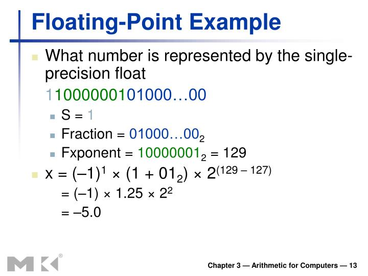

## Data Types

Data types specify how we enter data into our programs and what type of data we enter. C language has some predefined set of data types to handle various kinds of data that we can use in our program.

|   Data Type    | Storage Size |                     Value Range                      |
| :------------: | :----------: | :--------------------------------------------------: |
|      char      |    1 byte    |                     -128 to 127                      |
| unsigned char  |    1 byte    |                       0 to 255                       |
|  signed char   |    1 byte    |                     -128 to 127                      |
|      int       | 2 or 4 bytes | -32,768 to 32,767 or -2,147,483,648 to 2,147,483,647 |
|  unsigned int  | 2 or 4 bytes |          0 to 65,535 or 0 to 4,294,967,295           |
|     short      |   2 bytes    |                  -32,768 to 32,767                   |
| unsigned short |   2 bytes    |                     0 to 65,535                      |
|      long      |   4 bytes    |           -2,147,483,648 to 2,147,483,647            |
| unsigned long  |   4 bytes    |                  0 to 4,294,967,295                  |

---

```c++
char x
int  int_x
# to print the size of the data type
Serial.print(sizeof(x)); // 1

Serial.print(sizeof(int_x)); // 2
```

The size of the data type depends on the compiler.

## Why do we need Char data type?

```c++
char x = 'A';
char ASCII = 65;
Serial.print(x); // A
Serial.print(ASCII)

```

Charcter are important for storing the ASCII value of the character.

This is important for storing the character in the memory.

## integer data type

<!-- make table for a  different  integer size -->

|   type   |  size  |                    range                    |
| :------: | :----: | :-----------------------------------------: |
| unint8_t | 1 byte |                  0 to 255                   |
|  int8_t  | 1 byte |                 -128 to 127                 |
| uint16_t | 2 byte |                 0 to 65535                  |
| int16_t  | 2 byte |               -32768 to 32767               |
| uint32_t | 4 byte |               0 to 4294967295               |
| int32_t  | 4 byte |          -2147483648 to 2147483647          |
| uint64_t | 8 byte |          0 to 18446744073709551615          |
| int64_t  | 8 byte | -9223372036854775808 to 9223372036854775807 |

## Floating point data type

|  type  |  size  |        range         |
| :----: | :----: | :------------------: |
| float  | 4 byte |  3.4e-38 to 3.4e+38  |
| double | 8 byte | 1.7e-308 to 1.7e+308 |

> Floating point is very important for storing the decimal value which needs to be precise.

- Analog value
- Sensor value
- Machine learning value

In Arudino we have 4 bytes of memory for storing the floating point value.

## Conversion float point



```C++
bool x = true;
boolean y = false;

```

> boolean is the same as bool.

## Data type casting

```c++
int x = 10;
int  y= 3 ;
float mean = (float) x/y;

// other way to cast

int x =65 ;

// print the ASCII value of the character but the value should be in the range of 0 to 255
serial.print((char)x); // A


unit16_t a =257

unit8_t b = a;

// zero will be printed because the value is out of range which is called overflow
serial.print(b); // 0

unis16_t a = 10;
int8_t b = -2;
a=b;
// 65534 will be printed because unsigned integer can not store the negative value
serial.print(a); // 65534

```

Type casting is important for converting the data type from one to another.


## int promotion

```c++
uint8_t x = 100;

uint8_t y = 3;

uint8_t c= (a*b)/2;

// 150 will be int because the compiler will promote the data type to int
Serial.print(c); // 150

```