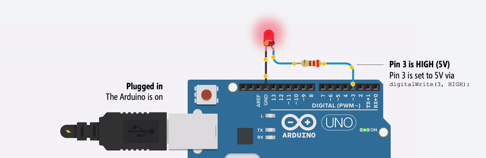

<!-- make table for arthmetic operators -->

## Arithmetic Operators

| Operator | Description | Example |
| :------: | :---------: | :-----: |
|    +     |     Add     |  a + b  |
|    -     |  Subtract   |  a - b  |
|    \*    |  Multiply   | a \* b  |
|    /     |   Divide    |  a / b  |
|    %     |   Modulus   |  a % b  |
|    ++    |  Increment  |   a++   |
|    --    |  Decrement  |   a--   |

## Assignment Operators

| Operator |    Description     |      Example      |
| :------: | :----------------: | :---------------: | --- | --- |
|    =     |       Assign       |       a = b       |
|    +=    |     Add assign     |      a += b       |
|    -=    |     Sub assign     |      a -= b       |
|   \*=    |     Mul assign     |      a \*= b      |
|    /=    |     Div assign     |      a /= b       |
|    %=    |     Mod assign     |      a %= b       |
|    &=    | Bitwise AND assign |      a &= b       |
|   \|=    | Bitwise OR assign  |      a \|= b      |
|    ^=    | Bitwise XOR assign |      a ^= b       |
|   <<=    | Left shift assign  |      a <<= b      |
|   >>=    | Right shift assign |      a >>= b      |
|    &=    | Bitwise AND assign |      a &= b       |
|          |         =          | Bitwise OR assign | a   | = b |

## Comparison Operators

| Operator |   Description    | Example |
| :------: | :--------------: | :-----: |
|    ==    |      Equal       | a == b  |
|    !=    |    Not equal     | a != b  |
|    >     |     Greater      |  a > b  |
|    <     |       Less       |  a < b  |
|    >=    | Greater or equal | a >= b  |
|    <=    |  Less or equal   | a <= b  |

## Logical Operators

| Operator | Description | Example  |
| :------: | :---------: | :------: |
|    &&    | Logical AND |  a && b  |
|   \|\|   | Logical OR  | a \|\| b |
|    !     | Logical NOT |    !a    |

## Example function

```c++
int shift(int x, int y){
    return x << y;

shift(10,2); // 40
}
```

## Bitwise Operators

```c++
#define p5_mask 0b00100000

void setup()
{
 DDRB = DDRB | B00100000; // set pin 13 as output

 DDRB |= p5_mask; // set pin 13 as output
}

void loop(){
PORTB = PORTB | (1<<5) // set pin 13 as high
delay(1000);

PORTB = PORTB & ~(1<<5) // set pin 13 as low

delay(1000);

}

```


> Hello world of embedded programming


## input Example


```c++
void setup()
{
  DDRB = DDRB & ~(1<<5); // set pin 13 as input
}

void loop(){
 int temp =PINB
 temp = (temp>>4);
 temp= &=1;
 
 PORTB |= (temp<<5);

}