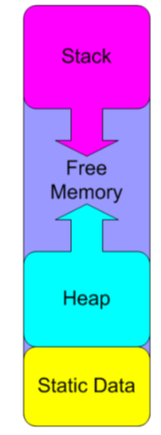

## Functions 

```C++
//forward declaration
int add(int a,int b)


void hello_world() {
   Serial.println("Hello World");
}   

int add (int a, int b) {
   return a + b;
}

void setup() {
   Serial.begin(9600);

   hello_world();

}
```

## global vs local variables vs static variables

 - global variables are declared outside of any function, and they can be accessed (used) on any function in the program.

- local variables are declared inside a function, and they can be used only inside that function.

- static variables are declared with the static keyword, and can be used only inside the function where they are declared.

```C++
        
int global_variable = 10;


void setup() {
   Serial.begin(9600);
   int local_variable = 20;
   Serial.println(global_variable);
   Serial.println(local_variable);
}
```
## Static Data 

This is a block of resevered space in memory that is not destroyed when the function is exited. 


## The  Stack

The stack is a block of memory that is used to store local variables and parameters used by any function.

## The Heap

The heap is a block of memory that is used for dynamic memory allocation. 


 

## Class and Objects


```C++

class Test {
  public:
    static void my_method(int x) {
        Serial.println("This is int = " + String(x));
    }

    static void my_method(float x) {
        Serial.println("This is float = " + String(x));
    }
};

void setup() {
  Serial.begin(9600);
  float  y = 23.2 ;
  Test::my_method(10);
  Test::my_method(y); // Use static_cast to specify it's a float
}

void loop() {
  while(1);
}

```

> The compiler will choose the correct function based on the type of the argument passed to the function.


> Static methods can be called without creating an object of the class.


## Flash Optimization

- Remove unused libraries
- Unsed variables
- Conditon that will never be true

## SRAM Optimization

- Remove Unused variables
- Perfer local variables over global variables
- use smallest variable type