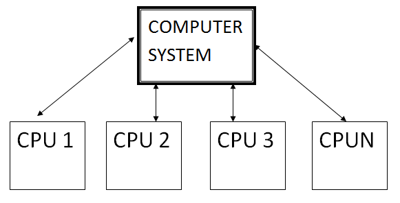
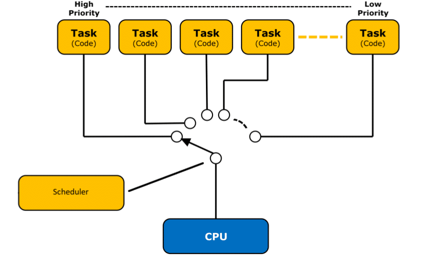

<h2 align ="center">Super Loop</h2>

> Is the basic model for running  any microcontroller The microcontroller is always running the same code over and over again

<h2 align ="center">Multitasking</h2>

- The ability of a microcontroller to run more than one task at the same time

- The microcontroller is running a task for a short period of time and then switch to another task

 

<h2 align ="center">Real Time Operating System RTOS</h2>

 > A real-time operating system (RTOS) is an operating system (OS) intended to serve real-time applications that process data as it comes in, typically without buffer delays.
 
 > In freeRtos the port the kernel is the part that is specific to the microcontroller and the rest of the kernel is the same for all microcontrollers

<h2 align="Center">RTOS Scheduler</h2>

> A scheduler is a software component responsible for deciding how and when to run tasks. It is the central part of any multitasking operating system.

### Hard RTOS vs Firm RTOS vs Soft RTOS

- Hard RTOS: The scheduler must always meet the deadline of the task

- Firm RTOS: The scheduler must meet the deadline of the task most of the time

- Soft RTOS: The scheduler should meet the deadline of the task but it is not mandatory