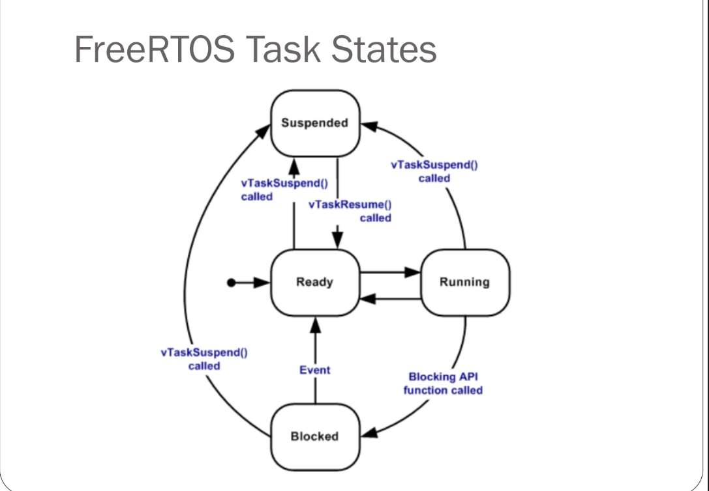

## vTaskDelete()

> This function allows for deleting the task stack and TCB from the heap and TCB from the head and hence permenataly deleting the task

> A task can easliy delete itself by call the function with NUll pointer

## VTasKSuspend 

> Task can suspend it'self  and it won't unSuspend it self until other task unsuspend it 

## FreeRTOS  State

